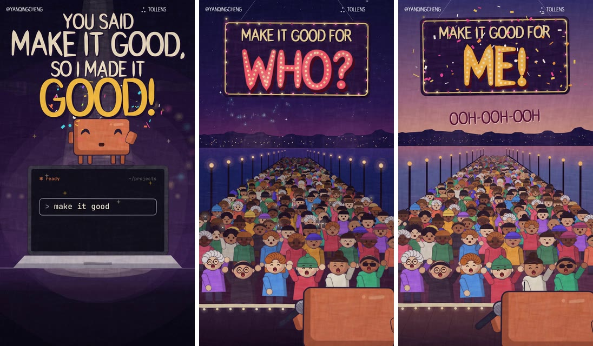

# Software Quality Theory 101

Short animated music videos about software quality, for people who build with AI coding agents.
Each episode teaches one idea from quality theory, and ends with what that idea changes about how
you brief your agent. Episodes 1 to 4 are out: episode 2 on 2026-09-28, episode 3 on 2026-09-29
and episode 4 on 2026-10-01. The series is in development, and its outline, scripts and animation
code are built in public here.



## Episode 1: "Good for Who?"

You ask your AI coding agent to "make it good", and it does, by its own idea of good: "Confetti
cannons every time you floss", "2FA to use your gym log", "Kubernetes scaling up your blog". In
the video, Clawd, the Claude Code mascot, sings as your agent, backed by a band of other AI bots.
Its line to remember:

> I can't read your mind, I'm only reading your prompt.

The idea it teaches: **software quality is value to someone who matters** (after Jerry Weinberg,
and James Bach and Michael Bolton, via Ed Pringle). So tell your agent who it's for, and what good
means for them.

More on episode 1:

- [The plan and the lyrics](episodes/01-you-never-told-me.md): what the episode teaches, the
  lyrics, and notes from the quality expert who checked them
- [How the video was made](episodes/01-video.md): the look, the lettering, how it was checked,
  and where it falls short
- [The code that draws it](video/ep01/pier/README.md)

## Episode 2: "How Will I Know"

[Watch it on X](https://x.com/YanqingCheng/status/2104707067353370891).

Your agent says "Fixed it!", you say "still broken", and round it goes. In the video, a boy band of
four Clawds sings to the people they built apps for: Rosa's bakery, a clinic whose booking site Gran
can't use, a school app that shows parents each other's messages, and Jess's wedding seating plan.
Every test they wrote passes, and they still can't tell whether you'll love what they made. Its line
to remember:

> I want you to love it, so give me something I can prove.

The idea it teaches: **somebody can always tell whether it's good, so say how they'd tell.**
Anything that helps you tell right from wrong is an oracle, a term from software testing (after
William Howden, Elaine Weyuker, and James Bach and Michael Bolton, with the framing for coding
agents from Qing, the series' quality expert). Put your oracles in the brief and the agent can check
its own work. The video ends on a card of four common kinds of oracle (there are more):

```text
HOW YOUR AGENT CAN KNOW
1 MECHANICAL CHECKS: Tools that test it: a linter, a load test on every merge.
2 COMPARISONS: Something to match: a mockup, a screenshot, other software.
3 HEURISTICS: Rules of thumb an agent applies: a skill file, a reviewer prompt.
4 SIMULATED USERS: Another agent plays your user and judges it as they would.
Give it these before it says "done".
```

More on episode 2:

- [The plan and the lyrics](episodes/02-how-would-you-know.md), with the expert's notes
- [How the video was made](episodes/02-video.md), including two earlier versions
- [The code that draws it](video/ep02/cutlight/README.md)

## Episode 3: "The 'Ilities"

[Watch it on X](https://x.com/YanqingCheng/status/2104998740893561019).

You think "it works and it looks fine, so it's good". In a patter song (the fast, wordy comic kind
Gilbert and Sullivan wrote), set in a park and a dog show ring, Clawd builds a dog-walking app that
books the walks brilliantly, then won't run on an older phone, dies at night and sinks when the
sign-ups soar. Then Clawd plays the agent asked to fix it, in code it can't debug. Its line to
remember:

> Which of the "ilities" are yours? I've got to know!

The idea it teaches: **"good" is many different qualities, the "ilities",** and getting one right
doesn't get you another. Agents build the few everyone mentions and skip the rest unless asked
(after Ed Pringle's catalogue of qualities, ISO/IEC 25010 and common use). So name the qualities
that matter most to the people it's for, the ones you'll trade away, and how you'll know each one.
The film ends on that question and a card of every quality the song names, in plain words.

More on episode 3:

- [The plan and the lyrics](episodes/03-name-your-ilities.md), with the expert's notes
- [How the video was made](episodes/03-video.md): the picture for every line, how it was checked,
  and where it falls short
- [The code that draws it](video/ep03/polka/README.md)

## Episode 4: "Did You Actually Test It?"

[Watch it on X](https://x.com/YanqingCheng/status/2105756056550830229).

Your agent says all two hundred of its tests pass. In a 1930s rubber-hose sing-along cartoon,
bouncing ball and all, Clawd shows off a gym app whose "tests" copy its own code, agree with its
mistakes and get rewritten whenever they complain. Then a testing crew, the vaudeville trio Press,
Stress & Guess, actually tests it, and finds that a set logged in a basement gym with no signal
says "Saved!" and is gone. Its line to remember:

> What did you try? What did you find? What changed your mind?

The idea it teaches: **checking applies a rule; testing investigates and can change what it
tries as it learns** (after James Bach and Michael Bolton). Checks help with testing, but copied
calculations can share an error and "Saved!" can fail to mean stored. Give a testing crew users,
goals, real browsers, a playbook and oracles; let it follow clues; ask for evidence, doubts and
limits; and keep the calls that could genuinely go either way for yourself.

More on episode 4:

- [The plan and the lyrics](episodes/04-did-you-actually-test-it.md), with the expert's notes
- [How the video was made](episodes/04-video-piano.md): the picture for every line, how it was
  checked, Qing's notes on all five versions, and where it falls short
- [The code that draws it](video/ep04/ball/README.md)
- An earlier film of the song's swing take, ["The Green Room"](episodes/04-video.md), drawn by Sol
  (Codex), wasn't posted.

## How it's made

- **An expert checks what each episode teaches.** Qing (Yanqing Cheng), who writes about software
  quality, is the domain expert: she corrects what an episode claims about quality, and she has the
  final say. Episode 3's pictures and its end card's plain-word meanings are still waiting for her
  line-by-line answers; [its video notes](episodes/03-video.md) list the open questions.
- **The videos are drawn in code.** Claude designed and wrote every posted film: episode 3's is by
  Claude Sonnet, which signs it, and episode 4's by Claude Opus, with three Opus builders drawing
  parts of it to the same brief. Each is JavaScript on an HTML canvas, one frame at a time, timed to
  the song, with a new look for every episode. The corporate badges are their makers' supplied
  marks. Episode 2's people and places were drawn through Codex by OpenAI's image generation, from
  the film's own frames, then cut out and animated as paper. Episode 4's cast, scenery and movement
  are original JavaScript drawings, with type from two openly licensed fonts.
- **The songs** have lyrics by Qing with Claude, and episode 4's by gpt-6.1-sol, with Qing's review and feedback. The music and the singing come from AI music
  generators, in takes Qing chose: MiniMax for episode 1, Suno for episodes 2 to 4. The repo also
  has a band and a singing voice made entirely in code, which episode 1 tried before switching to a
  generator.
- **Checks are measured where they can be.** Scripts check every sung word's size, contrast and time
  on screen, and how much each second of the video moves.
- **The method is written down,** so the next episode can reuse it: [LYRICS.md](LYRICS.md) for
  writing the lyrics, [music/README.md](music/README.md) for generated takes and timing,
  [VIDEO.md](VIDEO.md) for the video,
  [CRAFT.md](CRAFT.md) for the research on explainer videos people watch to the end, and
  step-by-step [skills](.claude/skills/) an AI agent can follow to write an episode, its song and
  its video.

Made by Qing (@yanqingcheng) at [Tollens](https://github.com/tollens-ai), with Claude and Codex. It isn't
affiliated with or endorsed by Anthropic, OpenAI, MiniMax, Suno, or any other company whose mascot,
logo or product appears in it.

## What's in this repo

| Where | What |
|---|---|
| [SERIES.md](SERIES.md) | The plan for the season: thirteen episodes, one idea each |
| [episodes/](episodes/) | Each episode's teaching plan, lyrics and expert notes, and its video's liner notes |
| [video/](video/) | The code that draws the videos: a renderer for each episode, and shared tools |
| [music/](music/) | Tools for the songs: timing analysis, checks, and the all-code band and voice |
| [CANON.md](CANON.md) | What the expert has approved about quality, for every episode to build on |
| [SOURCES.md](SOURCES.md) | Where the ideas come from, and who to credit |
| [research/](research/) | Sourced background: real software failures, testing as ritual, each AI maker's rules for using its logo, and how studios make videos |
| [archive/](archive/) | Two earlier attempts at episode 1's video that didn't work, and why |
| [WHO-ITS-FOR.md](WHO-ITS-FOR.md) | Who this repo is for, and what that asks of us |

## Draw the frames yourself

You need Node.js and Playwright's Chromium (and ffmpeg, to make a video). From the repo root:

```sh
npm install --no-save playwright
npx playwright install chromium
node video/lib/render.mjs --scene video/ep01/pier/main.js --song music/ep01 --stills 28.9,84.3 --w 1080
```

That draws two stills of episode 1 into `video/out/`. The song's audio and the AI makers' logos
aren't in the repo, so any video you render is silent, and simple stand-ins take the place of the
logos.
[The renderer's README](video/ep01/pier/README.md) has the rest, and each episode's renderer
([episode 2](video/ep02/cutlight/README.md), [episode 3](video/ep03/polka/README.md),
[episode 4](video/ep04/ball/README.md)) has its own.

## Credits

- **The idea** that quality is value to someone who matters comes to the series via Ed Pringle,
  whose wording is "value to someone (or something) who matters". It builds on Jerry Weinberg
  ("value to some person") and on James Bach and Michael Bolton ("who matters"). Each video
  credits its sources on screen, and [SOURCES.md](SOURCES.md) lists every source.
- **Oracles,** in episode 2, are an old idea in software testing: William Howden named them, Elaine
  Weyuker described the oracle problem, and James Bach and Michael Bolton treat them as fallible
  ways of spotting problems. The framing for coding agents is Qing's, from *Agentic coding and the
  problem of oracles*.
- **The "ilities",** in episode 3, come from Ed Pringle's
  [catalogue](https://github.com/tollens-ai/quality-assistant-prototype-03/tree/main/quality-brain/quality-attributes)
  of what stakeholders care about, the ISO/IEC 25010 quality model, and common use; the trade-offs between them are as Qing
  teaches them.
- **Testing and checking,** in episode 4, follow James Bach and Michael Bolton: a check applies a
  rule, and testing investigates. The approach to testing with a crew of agents is Qing's.
- **Clawd** is Anthropic's Claude Code mascot. In episode 1, the other bots carry their makers'
  official logos, unaltered; [SOURCES.md](SOURCES.md) says where each one comes from.

## Licence

- **Code** (renderers, synthesis, tooling) is under the [MIT licence](LICENSE).
- **Content** (scripts, lyrics, treatments, docs and the rendered videos) is under
  [CC BY 4.0](LICENSE-CONTENT). You can reuse and adapt it if you credit Tollens Ltd and link back
  here.

Ideas credited to other people in [SOURCES.md](SOURCES.md) remain theirs. The credit goes with them.
Clawd, and the other makers' mascots and logos in the videos, belong to their owners; these
licences don't cover them.
