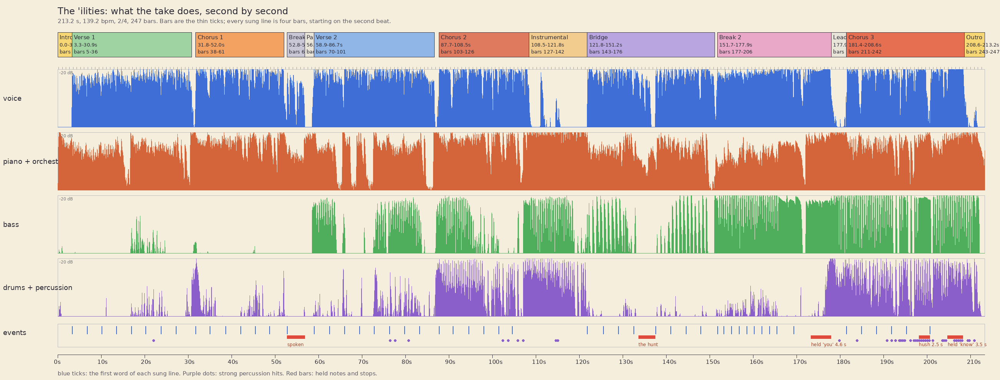

# Episode 3 video: "The 'Ilities", "Pencil Polka"

**Status (2026-09-29): pre-production done and a look proof drawn; the film itself is not built.** The
word timings are measured and waiting for Qing's ears (a karaoke check went to her phone), the
music is mapped, the storyboard and the plan are below, and the first ten seconds exist as a proof of
the look and the motion. Nothing here has been reviewed by Qing yet.

The take is Suno's "The _ilities_" (213.2 s), made to Qing's final lyric. The song, its style
prompt and the teaching plan are in [03-name-your-ilities.md](03-name-your-ilities.md). What the take
sounds like is in [music/ep03/listening-notes.md](../music/ep03/listening-notes.md). The style is
[Pencil Polka](../.claude/skills/music-video/references/style-pencil-polka.md), and its renderer is
[video/ep03/polka/](../video/ep03/polka/README.md). A Sonnet is making the video, at maximum effort, with
no reviewer committee, as Qing asked.

## Qing's brief (2026-09-29, verbatim)

> I have the audio track for you. I'd like us to start putting in the timings, storyboarding, and
> planning the animation now. Obviously we have the dog show theme or the dog walking theme so there
> should be a lot of good stuff to work with in terms of thematic animation. Obviously this is a
> patter song, very dense with technical content, so there's a lot to work with in terms of content
> design as well. You want to make sure that you're thinking of the best way to visually convey each
> of the concepts that we're talking about in every line, such that it's as educational as possible
> while also being very entertaining.

> In terms of style I was thinking let's lean into your strengths, which are sketch-style
> illustrations, doodles, and pencil-and-paper-style illustrations. Go for a dancing doodle style,
> almost like pencil crayon or that kind of really hand-drawn messy sketch on paper. I think that
> style will be easy for you to get the dogs cute without wasting too much effort on trying to make
> them realistic: just really, really cartoony, doodly, almost like a small child's animations, a
> small child's drawings come to life, but obviously a really talented small child. Because of that,
> scraggly hand-drawn frame-by-frame animation, classic 2D animation style. You can actually do
> that, making the motion almost a slight pulsing, like the drawings are almost slightly pulsing or
> dancing to the umpa beat of the music because the music is so upbeat and particular. You'll want
> to make sure that you're mapping out the details of the music.

> I still want Claude to be the main singer for this so you'll want to reuse some character design
> elements but obviously we're adapting it to a completely different style and that's totally fine.
> You'll want to make sure that the lettering you pick is in keeping with the style and you'll want
> to make sure that in the instrumental sections we use them well. Obviously there are no lyrics
> there so we can use them either for comedic moments, for continuity, or to explain some of the
> concepts a little bit further. It's totally your choice how to use the instrumentals but given
> that it's orchestral and different instruments are involved, you'll want to think about what the
> best alignment and match between what's happening on the screen and what's happening in the music
> is.

> As usual I'll turn effort up to max. I would like this to be a pure sonnet effort so you may use
> subagents but I want you to limit yourself to sonnet subagents. The brief, as always, is to have a
> really high aesthetic bar. Just because it's a rough style doesn't mean I want rough work. The
> style is a stylistic choice but I want something that's really artistically considered and I just
> want you to go all out as usual.

Earlier, in the lyric work (2026-09-29, from the scratchbook): "lean into dog-show imagery. A rosette
per quality dimension, a best-in-show award (e.g. best intro to the app, or to Claude), jumping
through hoops, chasing balls." The image set is dogs and dog-walking, not a uniform or medals.

## What the viewer must understand, and the line they'll remember

**By the end:** good isn't one thing but many different, independent ways software can be good or
bad (the "ilities"); they pull against each other, so you have to say which ones matter to you, both
for the people who use it and for the agent that has to work on it.

**The line to remember:** "Which of the 'ilities' are yours? I've got to know!", the chorus, three
times, each further on. The one under it, from the bridge: "the ending's not the point: they're all
dimensions, rhyme or not!"

**Why someone opens it, watches to the end, and shares it.** They open it for a talented-child
doodle of dogs doing something silly; the thumbnail is a title page in coloured pencil with Clawd
and a dachshund, nothing like the other two episodes. Every three seconds there is a new drawn gag
that finishes on the line's last word, and each gag is a real failure they have met. They stay for
the escalation: a quieter first verse, a night show, a wild parade of sixteen dogs, a held note,
and a hush before the last question. They share the singalong (a bouncing ball hops along every
chorus line, so anyone can join in) and the cheat sheet at the end, which names every quality in
the song in plain words and can be screenshotted.

## The record

Measured from the take (details in the listening notes). 139.2 bpm, 2/4, an oom on the first beat
and a pah on the second, steady all through. Every sung line is four bars and begins on the
second beat (a pick-up); the patter lines have 16 syllables on 8 beats. Each section is louder and
fuller than the last: piano and light orchestra alone under the first verse, then a crash and the
group of voices, a bass line in verse 2, drums in chorus 2, everything in chorus 3.

| Section | Seconds | Bars | What the picture does with it |
|---|---|---|---|
| Intro | 0.0-3.3 | 1-4 | the title page, written; Clawd and Bruce jump in; the page flips on the beat |
| Verse 1 | 3.3-30.9 | 5-36 | the park, in the morning: one gag a line, the app failing ility by ility |
| Chorus 1 | 31.8-52.1 | 38-61 | the dog show ring by day: Clawd judges the app; a bouncing ball hops the words |
| Break 1 | 52.8-56.8 | 63-67 | spoken, the band falls away: a page of graph paper, Clawd puts on a hard hat |
| Verse 2 | 58.9-86.7 | 70-101 | inside the code, which is one huge shaggy dog: the agent's troubles |
| Chorus 2 | 87.7-108.5 | 103-126 | the ring by night: now Clawd is the one being judged |
| Instrumental | 108.5-121.8 | 127-142 | the agility trials, four runs in four phrases; independent scores |
| Bridge | 121.8-151.2 | 143-176 | a ruled school page: what a dimension is |
| Break 2 | 151.7-178.0 | 177-206 | the runway parade of sixteen dogs, then a hundred, then the held "you" |
| Lead-in | 178.0-181.4 | 207-210 | drum build: the ring assembles |
| Chorus 3 | 181.4-208.6 | 211-242 | golden hour, the whole show at once; a hush; a held "know" |
| Outro | 208.6-213.2 | 243-247 | the last chord; a wink; then the cheat sheet |

## The world and the style, in three sentences

The film is a page of a child's sketchbook that comes alive: a park where dogs are walked, and a dog
show ring where software is judged, one rosette for each way it can be good. The pencil draws
everything, including the words, which it writes on as they are sung, and the drawings redraw
themselves twelve times a second and squash and lean on the oom-pah. The pack of dogs and the
rosettes grow through the song from one blue ribbon to a whole ring, and end with you choosing the
few that are yours.

## The look, the words and the motion

Summarised here; [the style reference](../.claude/skills/music-video/references/style-pencil-polka.md)
has the detail, and [video/ep03/polka/](../video/ep03/polka/README.md) the code.

- **Look.** Coloured pencil on cream paper: every line is a ribbon-shaped pencil stroke with the
  grain in the stroke, drawn twice and a little apart; colour is zigzag hatching that spills over
  the outline; backgrounds are big loose crayon scribbles. No texture over the frame. Plain paper
  for the park and the ring by day, graph paper for the code, ruled paper for the lesson, dark blue
  paper and light pencils for the night ring, warm peach for the finale.
- **Motion.** A 12-per-second boil in a three-version cycle; the whole cast squashes on the oom,
  leans on the pah, and lifts on every beat, the amount following the music's loudness; camera
  moves and pops at 30 frames a second. Joins: a top-bound notebook page turning up and away on
  the big changes, a pencil scribble wiping the old picture out between lines.
- **The words.** Hand-printed capitals, written on by the pencil so each word is finished 85 ms
  before it is sung (episode 2's lead, until Qing picks this take's). Each patter line is a poster:
  its body words in graphite, its last word, the "-ility", big on a row of its own in outlined
  bubble letters with the ility's colour. Words bob on every beat that falls inside them and a long
  word ripples one letter group per beat, so the lettering plays the rhythm. In the choruses the
  words sit on a board with a **bouncing ball**: Bruce's ball hops from word to word on the beat and
  he chases it, the way a sing-along cartoon does.
- **Rosettes.** Each quality is a prize rosette with its own colour, the same colour every time it
  comes back. It is pinned on when the song names it, droops or floats off when it fails, and
  hangs empty with a "?" when it's missing. That is the running visual grammar: a rosette is a
  quality; a ring full of rosettes is "the whole of software quality".

## The cast

| Who | What they are | Drawn as |
|---|---|---|
| **Clawd** | sings; the builder in verse 1, the agent in verse 2, the judge and the judged in the choruses | the mascot's block in terracotta: wide body, two tall eyes, stub arms at five-eighths height, four short legs; no mouth until he sings, then an O that follows the voice |
| **Bruce** | the dachshund: the customer's dog in verse 1 (his ball is the bouncing ball), the hero of the agility trials | a long brown sausage with a big head and a blue collar; long enough to bend through a hoop |
| **Blob** | the code, in verse 2: a huge shaggy sheepdog. He is the small fluffy puppy that grows behind Clawd's back in verse 1's last lines | a grey scribble of fur with two feet and a nose |
| **The owners and clerks** | an owner with an old phone (Ada), a bulldog shop clerk, the judge (a bulldog in a bowler), the cat who won't walk, the walkers | round-headed doodle people and front-on dog busts (bulldog, lab, poodle, corgi, sheepdog, beagle, pug, chihuahua, dalmatian, husky, greyhound) |
| **The audience** | rows of dog heads at the bottom of the ring, singing and swaying; in chorus 2 some are Clawds | front-on busts, mouths going on the words |

## Storyboard

One picture a line, in song order. Times are the first word's onset to the last word's end; the
build takes each shot's beats from the word times (`words()` in `kit.js`), so if a timing moves the
picture follows. "Tail" is the line's last word, the ility.

### Intro (0.0-3.3 s) and Verse 1 (3.3-30.9 s): the park, in the morning

Plain cream paper under a pale blue sky wash and a green meadow to the foot of the frame. The
quietest, plainest section: piano and a light orchestra with the voice alone.

| Line | Picture: the one thing to read | What it teaches, and how | Beats on the words | Tail |
|---|---|---|---|---|
| **Title** 0.0-3.3 | the title page: SOFTWARE QUALITY THEORY 101 · EPISODE 3, "THE ILITIES" written on; three rosettes pop on the first three beats; Clawd jumps in, Bruce trots in; the page flips up on the beat at 2.32-2.74 | the series and the word the whole film is about | title writes bars 1-3; rosettes 1.06, 1.48, 1.91; flip 2.32-2.74 | |
| **1** 3.3-6.3 *Correct I built it, then I checked: it books the walks so brilliantly!* | Clawd shows a big phone, the Walkies app, filling its calendar with paw stamps; his clipboard of checks ticks itself; a blue rosette pinned on with a burst | functional correctness: it does the job, and the checks pass. This is the naive first win: one rosette | phone pops in on "Correct"; ticks at "it," (4.16) "checked:" (4.59) "it" (4.98); stamps on "books" "walks" "so"; burst, rosette and BOOKED! on "brilliantly!" (5.99) | blue |
| **2** 6.8-9.3 *An older phone? The store says no, so where's compatibility?* | an owner holds up an old brick phone at an App Store counter; the bulldog clerk brings a rubber stamp down on "no," (8.20) and NO lands on the DOWNLOAD counter; question marks pop over her, and an empty green rosette with a "?" hangs | compatibility: it has to work on the devices people have | "older" "phone?" (6.89, 7.21) the old phone rises; stamp lifts on "store" and lands on "no,"; "?"s on "where's" | green |
| **3** 10.1-12.9 *The sign-ups soared, performance dived, and that's poor scale-ability!* | a tall diving board over a paddling pool marked SERVER; a counter on its post spins up, dogs join the end of the board on each beat, 1, 2, 4; the board bends and dives into the pool, and snaps; the rosette sinks | performance (it slowed) and scalability (it can't take more); the board is a real limit, and it doubles as the "dived" pun | "sign-ups" (10.25) counter runs; dogs pile on at 10.36, 10.79, 11.2; "performance" (11.03) the board bends; "dived," (11.57) splash; "scale-ability" (12.49) crack | violet |
| **4** 13.5-16.2 *It died at night; the dogs all cried: goodbye, reliability!* | the first dark page: night, a moon, three houses with lit windows; the app's screen goes black and flatlines; a dog howls at each window with a lead in its mouth; the red rosette floats up on a balloon string and away past the moon | reliability: it has to work when you need it, including at night | "died" (13.72) the screen goes out; "cried:" (14.98) tears and AWOOO; "goodbye," (15.29) paws wave; "reliability!" (15.83) the balloon rises and the letters droop like tears | red |
| **5** 16.9-19.7 *Accessibility's a mess and so is use-ability!* | back to day, one picture in two halves: an owner squinting through a magnifier at tiny text, then Bruce's huge paw missing a tiny button; then the app is a maze of menus with the user lost in it; a purple rosette hangs crooked, an orange one is tangled in a lead | accessibility (people who can't read small print or tap tiny buttons, among others) and usability (a clear way through); two rosettes | "Accessibility's" (16.95, held) magnifier and paw; "a mess" (18.26, 18.47) everything wobbles; "use-ability!" (19.32) the maze draws itself | orange |
| **6** 20.2-22.8 *Walk cats? It cost a second app. Good grief, extensibility!* | a speech bubble asks WALK MY CAT? and a grey cat on a tiny lead goes limp; Clawd has to build a second phone and coins pour out; hands on head; a teal rosette with a tiny ribbon taped on to reach | extensibility: can it grow to do what you didn't plan? | "cats?" (20.58) the cat flops; "second app." (21.36, 21.77) the second phone; "grief," (22.08) hands on head; "extensibility!" (22.43) tape and ribbon | teal |
| **7** 23.8-26.6 *What you don't know can hurt you through a growing liability.* | Clawd admires his row of rosettes; behind him a small fluffy puppy grows a size on each stress; on the last word its shadow covers him and its wagging tail sweeps him off his feet | the refrain: the qualities you never thought about become a liability | "know" (24.39) "hurt" (24.86) "growing" (25.62) each a size; "liability." (26.25) the shadow, and the letters grow, one syllable bigger each | red |
| **8** 27.2-30.4 *So leave no stone unturned, and see the whole of software quality.* | Clawd turns over stones in the meadow, a rosette under each; on "and see the whole" the camera pulls back on a meadow of turned stones and rosettes that turns out to be the ring, bunting unfurling; SOFTWARE QUALITY hangs as a banner | the refrain: look at all of them, not one | stones at "leave" (27.50) "stone" (27.78) "unturned," (28.06); pull-back from "see" (28.73); banner on "software" (29.48); a crash at 31.1 flips the page | many |

### Chorus 1 (31.8-52.1 s): the ring by day

A yellow-cream page under bunting, a rope ring, a row of dog heads along the bottom singing and
swaying, a board across the top with the lyric and the bouncing ball. The ball hops once a beat and
lands on a stressed word; Bruce chases it along the bottom of the board. Each line has one gag under
the board. Six gags, played three times, each time further on.

| Line | Gag | What it teaches | Beats |
|---|---|---|---|
| **1** 31.8-34.3 *Good in a dozen ways, and bad in others, though:* | Clawd, as judge, presents the show dog (a scruffy mutt with a WALKIES badge) on the table; twelve rosettes appear round it on a string, one a beat; on "bad in others" four wilt and go grey | good is many things, and it is bad at some | rosettes on the beats through "dozen" (32.27); the four droop on "bad" (33.12) "others," (33.55) |
| **2** 35.0-38.2 *Fast, but it crashes; is it steady? Sound? Oh, no.* | a greyhound streaks across the ring, hits the hurdle at "crashes;" (35.64) and cartwheels; Clawd runs a hand down its legs, "steady? Sound?" (36.42, 36.96), and on "Oh, no." (37.60) a leg pops off. In a dog show, a "sound" dog has good structure and movement | speed and reliability are different, and "sound" has two meanings | crash on 35.64; the leg on 37.60 |
| **3** 38.6-41.0 *Ship it by Sunday; it's a pain to change, and slow;* | a doodle ship (a crate hull, a SUN flag) races right; at "pain to change" (39.82, 40.28) Clawd tries to turn the wheel and it comes off in his hands; "slow;" (40.68) the ship turns into a snail | shipping fast against being easy to change | flag at "Sunday;" (39.03); the wheel at "change," (40.28); the snail on "slow;" |
| **4** 42.0-44.8 *Save on the checking, and the bugs can wreck the show;* | a piggy bank grins beside a booth marked CHECKING, BACK IN 5 MIN; a line of beetles and fleas marches in through the gate and swarms the ring; the rope and bunting fall | saving on checks costs you the show | booth at "checking," (42.48); bugs at "bugs" (43.28); "wreck" (43.79) the collapse |
| **5** 45.5-48.3 *Polish one part, and then another takes a blow:* | Clawd brushes one paw of the show dog to a shine (sparkles), and a blow-dryer, at "takes a blow" (47.06-47.90), blasts the other end into a mess | improving one thing can cost another | brush on "Polish" (45.46) "part," (45.91); the dryer on "takes" |
| **6** 48.7-51.8 *Which of the "ilities" are yours? I've got to know!* | the twelve rosettes lift and orbit; a spotlight sweeps the ring and lands on the camera; Clawd points at you on "yours?" (50.15) and pushes in to a close-up for "I've got to know!" (50.45-51.43); a drum hit at 51.97 | the film's question | spotlight on "ilities" (49.35); point on "yours?"; the hit |

### Break 1 (52.8-56.8 s): the page of the code

The band falls to almost nothing. The page flips up onto graph paper. Clawd turns from the ring to
the camera and sighs on "Right." (52.77); a hard hat with a headlamp drops on his head, and behind
him, in the corner of a graph-paper page, something huge and shaggy breathes. "You want me to fix
the code?" (53.34-54.12): he points at it. "Then here's what I need from it." (55.03-56.58): he
holds up a clipboard with blank name tags, one for each thing he's about to ask for. A held stillness
that isn't still: the breath, the boil, a blink. The two seconds after (56.8-58.9) are the pick-up:
he walks up to the sleeping dog as a bass line starts under him. That is Blob, the code.

### Verse 2 (58.9-86.7 s): the agent in the code

Graph paper, a headlamp, and Blob the shaggy dog as the codebase: the bugs are fleas, the docs a
dog-eared manual, the context a dog bowl. A bass line has come in, and the pulse is a little bigger.
The tails are in cooler colours, so it's clearly the other family of ilities.

| Line | Picture | What it teaches, and how | Beats | Tail |
|---|---|---|---|---|
| **1** 58.9-61.6 *Confused, why can't I reproduce it? No debuggability.* | Clawd, confused, tells Blob to "sit"; nothing; he does it again, again; a tiny flea in a top hat pops up only when he looks away and ducks when he swings a net | debuggability: can you make the problem happen again, to study it? | "reproduce" (60.12) the same trick three times; "No" (60.90) the flea ducks | teal |
| **2** 62.5-65.0 *I ask it why: it's "Oops". Gee, thanks for diagnosability!* | Clawd holds a stethoscope to Blob and asks why; the answer is a small sheepish bubble that says OOPS, beside a broken vase; Clawd's deadpan thumbs-up | diagnosability: does it tell you why, not just that it failed? | "why:" (62.93) ask; "Oops" (63.45) bubble; "Gee," (63.78) thumb | sky |
| **3** 65.9-68.6 *I wipe the payments? Stale docs: "Nightly saves!" Recoverability?* | Clawd wipes a piggy bank labelled PAYMENTS clean off the page; a dusty dog-eared manual reads NIGHTLY SAVES!; he opens the BACKUPS cabinet and it is empty, a moth flies out; a retriever comes back with nothing in its mouth | recoverability (getting back what you lost), and stale documentation that lies | "wipe" (66.14) the bank vanishes; "Stale docs:" (66.90, 67.23) the manual; "Recoverability?" (68.23) the empty cabinet, the retriever | green |
| **4** 69.4-72.1 *We walk it through by hand, and miss a lot: low testability.* | Clawd literally walks Blob round a course on a lead, ticking a clipboard, while a line of fleas slips past behind him; an AUTO-TEST machine's plug doesn't fit Blob | testability: can it be checked automatically, or only by walking it through | "walk" (69.57) the lead; "miss a lot:" (70.84, 70.98, 71.08) the fleas file by; "low" (71.44) the plug | purple |
| **5** 72.8-75.7 *The blob's so huge, I burn my context: not much readability.* | Blob fills the frame; Clawd, tiny, scoops kibble from a bowl marked CONTEXT to read each strand, and the bowl runs dry; the writing in the fur is unreadable | readability (can an agent find its way), and lean context | "blob's" (72.91) the bulk; "burn" (73.93) the bowl empties; "readability." (75.36) the fur scribbles | blue |
| **6** 76.3-78.8 *I patch one bug, and two more hatch: so where's maintainability?* | Clawd whacks a flea; two eggs crack and two fleas hatch; he whacks those; four eggs; the empty pedestal for maintainability | maintainability: changing one thing shouldn't break others | "patch" (76.44) whack; "two more hatch:" (77.32, 77.68) the eggs, 1 then 2 then 4 on the beats | navy |
| **7** 79.7-83.2 *What you don't know can hurt me too: it goes and puts me ill at ease.* | the puppy from verse 1, now huge, looms over a Clawd on a wobbling stool with a thermometer in his mouth; on "ill at ease" the letters ILL AT EASE shake themselves into 'ILITIES | the refrain again, for the agent; and the pun | "hurt" (80.81) the shadow; "puts me ill at ease." (82.11-82.81) the letters rearrange | yellow |
| **8** 83.2-86.3 *You'll make my day: just name and weigh the agent-facing "ilities".* | a smiling sun rises behind Clawd as he holds out his arms to you; a kitchen scale in front, rosettes on its pans; name tags handed out and weighed | your job: name them and say how much each matters | "day:" (83.82) the sun; "name" (84.28) the tags; "weigh" (84.69) the scale tips | multi |

### Chorus 2 (87.7-108.5 s): the ring by night, and the tables turn

Dark blue paper, light pencils, fairy lights and spotlights; the bulldog is judge and Clawd is on
the table; the row of dog heads has Clawds among them, because agents are people who matter too. The
drums come in, so the pulse and the confetti are bigger. Same six gags as chorus 1, with Clawd as the
subject: he wears twelve rosettes and four wilt; he sprints and crashes and the judge feels his legs
and one falls off; he is nailed into the ship crate; the bugs swarm his screen; he is polished on one
side and blown on the other; and the last line is sung straight to you again, from the table, the
bulldog and all the audience turning to look at you with him.

### Instrumental (108.5-121.8 s): the agility trials

Sixteen bars, no voice, full band, and the place to show what the bridge is about to say: each way
of being good is separate. The ring is now an agility course (seesaw, tunnel, weave poles, hoop,
hurdle) in daylight, with a scoreboard of four dials: SPEED, CARE (no faults), COST and FUN. Four
dogs run one course in four four-bar phrases, and no two score alike:

| Bars, seconds | Dog | Run | Scoreboard |
|---|---|---|---|
| 127-130, 108.4-111.9 | a greyhound | flat out, and knocks down everything | speed high, care low |
| 131-134, 111.9-115.3 | a basset hound | ambles through every obstacle, perfectly, while the crowd naps | speed low, care high, cost low, fun low |
| 135-138, 115.3-118.7 | a great dane with a gold collar | fast and clean, and the price tag drops out of his collar | speed high, care high, cost very high |
| 139-142, 118.7-122.2 | Bruce | wobbles, falls off things and is adored; the band thins to a bass climbing, stabs on the second beat and a high trill as he makes the last hurdle; the last bar's fill flips the scoreboard into the bridge | cost low, fun very high |

No dog wins everything, so the judge hands out four different rosettes. The first hit of each
phrase is a page-wide pulse, the third phrase's stabs are the great dane's paw-prints, and the
trill is Bruce's legs.

### Bridge (121.8-151.2 s): the lesson

A ruled school page with a red margin, Clawd at a board with a pointer. The band nearly stops for
the hunt, at about 133-137 s.

| Line | Picture | Beats |
|---|---|---|
| **1** *A quality dimension is a way it's good or bad,* | QUALITY DIMENSION written on the board; under it one slider from a puddle (BAD) to a rosette (GOOD) with a little dog on it, a pointer that slides | "dimension" (122.67); "good or bad," (124.43, 124.77) the pointer goes end to end |
| **2** *and each is independent: that's the part that drives you mad!* | six dogs on six leads, each with its own slider, each pulling a different way: they move on their own beats, out of step, and Clawd is dragged apart with steam coming out of his ears | "independent:" (126.07); "mad!" (128.32) |
| **3** *And most of them are "ilities", which rhyme: a lucky break!* | the dogs' collar tags all end in -ILITY and click together like puzzle pieces; on "break!" a dog biscuit snaps neatly in two | "rhyme:" (130.81); "break!" (131.73) |
| **4** *But some of them are not, and so I hunt, for goodness' sake:* | three collars with odd endings (PERFORMANCE, COST, CORRECTNESS); Clawd, on all fours, sniffs like a bloodhound through a heap of dictionaries in a spotlight; the hush at 133-137 s is the hunt | "not," (133.64); "hunt," (134.59); the silence |
| **5** *Resilience... resilience... ...a stroke of brilliance!* | a bulldog is flattened by a rolling pin and springs back, twice; then Clawd's pencil draws one confident stroke and it lights up | the springs on 137.53 and 138.43; "stroke" (139.37) |
| **6** *Compliance... compliance... ...it's rocket science!* | a dog sits, stays, on a rulebook's orders, twice; then the rulebook's stack of forms is strapped to a rocket and lifts off | "compliance" 141.01 and 141.89; "rocket" (143.11) |
| **7** *The "ilities"? A nickname for the family, the lot:* | a family portrait of the dogs on a frame labelled THE 'ILITIES, the odd-named ones in it too | "nickname" (145.53); "lot:" (147.22) |
| **8** *the ending's not the point: they're all dimensions, rhyme or not!* | the -ILITY endings fall off every collar and each dog is left with a sash reading DIMENSION; the sliders all set differently | "ending's" (148.20); "dimensions," (149.73); "not!" (150.75) |

### Break 2 (151.7-178.0 s): the parade

The ring is a runway. Eight lines of two, sixteen dogs, two bars a line, a rosette each with the
word on it, the fastest words in the song at about 7 syllables a second; then the camera pulls back
on a hundred; then a held note.

| Bars | Words | Two dogs |
|---|---|---|
| 177-178, 151.7 | **upgradability, replaceability** | a doghouse grows a new floor; a row of identical kennels, one dog slides out and a new one in, the row unharmed |
| 179-180, 153.2 | **explainability, traceability** | a guilty dog holds up a note that says BECAUSE; a hound follows a thread back to where it began |
| 181-182, 155.0 | **observability, reversibility** | an X-ray dog with a heartbeat line, watched from outside; a dog jumps into mud and an UNDO arrow pulls it out clean |
| 183-184, 156.7 | **installability, portability** | a flat-pack box, one paw on a button, a doghouse pops up ready; a chihuahua in a handbag carried through park, boat and bus |
| 185-186, 158.5 | **flexibility, detectability** | a dachshund bends into an S through a hoop; a beagle with a magnifier finds a bug under a leaf |
| 187-188, 160.2 | **suitability, reusability** | a dog in a suit that fits, a great dane in the same suit that doesn't; one ball fetched and fetched again with a recycle arrow |
| 189-190, 162.0 | **sustainability, changeability** | a dog waters a sapling; a dog quick-changes hats in a phone box |
| 191-192, 163.7 | **deployability, enjoyability!** | a dog parachutes into the ring when a red DEPLOY button is pressed; the happiest dog in the world, tongue out, in a burst of confetti |

Then **"I could name you a hundred, and still not be through,"** (165.4-168.8): the runway
zooms out and the parade runs to the horizon in a doodled crowd of hundreds. **"but the ones that
you want? That's a question for you!"** (169.3-173.7): every head in the crowd turns to the camera,
and on "for you!" (172.90, 173.31) a spotlight lands on you and Clawd steps forward and holds a
lead out to the camera. The vowel of "you" is held for 4.6 s (173.3-177.9): the lead held out,
the crowd swaying very slightly with the vibrato, a slow push in on his hopeful face, every line
still boiling. It is the film's deliberate stillness.

### Lead-in (178.0-181.4 s)

Silence from the voice, a drum build. The crowd scrambles into the ring, the curtain at the back goes
up, Clawd swaps the hard hat for a judge's bowler, the bouncing ball appears; the last chorus's crash
at 181.4 is a shower of confetti and a jump of the whole page.

### Chorus 3 (181.4-208.6 s): golden hour, the whole show at once

Warm peach paper, a low sun, everyone in the ring. Where chorus 1 gave one gag a line and chorus 2
turned them round, chorus 3 plays all six in three rings at once, and the camera whips to each on its
line, the audience roaring. The dozen rosettes end on twelve different dogs, each standing on its own
mark. Under "Polish one part..." (195.2-198.1) the last gag plays; then **a hush of about 2.5 s
(198.1-200.6)**, in which everything stops, the dogs turn to look at you, a spotlight comes down and the
ring goes quiet, and the ball rests on the board. Then the last line, a close-up: **"Which of the
'ilities' are yours?"** (200.6-202.5) **"I've got to know!"** (202.8-205.1), and the held
**"know!"** (204.70-208.2), during which fireworks and ribbons fall over a Clawd holding up
three rosettes: the ones that are yours.

### Outro (208.6-213.2 s) and the end card

The last chord: the confetti settles, the dogs sleep in a heap, Bruce lifts his head and winks at
the camera on the last drum hit (about 212.4 s), and the page closes. Then **the end card**: a page
in the sketchbook with every quality the song names, a small doodle beside each and its meaning in
about eight plain words, for screenshotting. It holds for about six seconds after the music ends, the
one place the film is still on purpose. (See the questions: this wording is a claim, checked against
Ed Pringle's catalogue where it has a page.)

## The plan

**How it is built.** One auteur (me), the shared renderer and one new style module. The film is built
in layers so there is always a watchable cut: (1) the lyric video, every word written on in time,
with a plain drawn background for each section and the page turns; (2) each line's gag, hero
shots first (verse 1, chorus 1, the agility trials, the parade); (3) the repeats, each further on
(choruses 2 and 3, verse 2's callbacks); (4) the life in the corners (ambient animals, the audience
singing, confetti) and the polish. Every layer is rendered as a 540-wide preview and looked at as a
contact sheet, motion per second, and frame strips across every join, before the next.

**Assets to draw, by file.**

| File | What | Roughly |
|---|---|---|
| `chars.js` | Clawd with every expression and prop; Bruce side-on, walking and stretching | done for the first ten seconds; hoop, bend, jump poses to add |
| `people.js` | people (posed, holding things); front-on dogs in twelve breeds; Blob; the cat | people and eleven breeds drawn; Blob, the cat, hats, a judge's bowler to add |
| `props.js` | rosettes, phones, clipboard, calendar, stamp, ticks, bursts; then the diving board, moon, houses, magnifier, mallet, eggs, fleas, scales, cabinet, bowl, hurdles, tunnel, seesaw, poles, ship, crate, hoops, ribbons, bunting, ball, board | first dozen done; about fifty to add |
| `scenes/` | one file per section, each shot a function of the words' times | intro and the first two lines done |
| `board.js` (to write) | the sing-along board: lyric rows on a banner, the ball's path from the word times | |
| `tools/` (to write) | the typography audit (every word's size, time on screen, cover, contrast, reading order), the shot lister, the preview and master render scripts | copied from episode 2 and adapted |

Sonnet subagents draw props and breeds against the kit and its worked examples (one file each, to
a brief, with their own preview stills), and I look at and redraw everything they return; the
drawing of the gags, the timing, the lettering and every review are mine.

**Checks before Qing sees a cut.** The words (every one: size, time on screen, contrast, cover,
reading order, the phone's button strip); the story from the pictures alone (each sung line has
something drawn of what it says); motion per second (nothing still that shouldn't be); the crowd
and props by eye; a contact sheet of the lyric frames at 390 px wide; and the hand-back gate in the
music-video skill.

**Risks.** The number of unique gags (about seventy compositions) is the cost, so props are reused
and the parade is cut sixteen short pictures on a fixed runway. The bottom 400 px of the frame is
the phone's button strip: the ground runs to the foot of the frame but no gag lives there. Colour
on dark paper needs its own ink: the night ring uses cream lines and pale hatching. Drawing "sound" as
a dog-show word and "hatch" as eggs are puns that need a beat to land; they get one.

## What's done

- **The timings** (`music/ep03/lyrics.json`, the captions in `captions.srt`): every one of the 487
  sung words, from the voice. Two aligners (torchaudio's MMS_FA and its English wav2vec2), each at
  three playback speeds of the isolated vocal stem (1.0, 0.8, 0.65: the patter runs at 5 to 8
  syllables a second, too fast for a character-level aligner at natural speed), on each line inside
  a window that also holds the line before and after; two Whisper runs (large-v3, on the vocal
  stem and on the mix) as further votes once their bias (about 60 ms early) is taken off; median
  of the votes, snapped to the nearest onset of sound on the stem; then a check that repeated lines
  (the three choruses) are sung alike. The two aligners' word starts differ by a median of 16 to 26 ms depending on the
  playback speed (90th percentile 40 to 52 ms). The check found one real error, "Polish" in chorus 3, and moved it. Twelve words
  stay flagged for a reason: the last line of chorus 3 is sung slower (the ritardando is real); a few
  are 100 to 140 ms from their repeats, and one is the last, whispered word of the spoken break.
  Spectrograms of the voice with the word onsets drawn on them were checked for the fastest passage
  (the sung list), the first verse lines and the choruses' last lines.
- **The karaoke check** (`video/ep03/karaoke/`, 213.2 s, 6,396 frames) went to Qing's phone: each
  word lights up 85 ms before its measured onset, with a dot in the corner on the beat (orange on the
  oom, blue on the pah), which also checks the beat map.
- **The music map:** `music/ep03/beats.json` (the beat and bar grid, the sections), `audio.json`
  (each stem's loudness at 20 Hz, percussion, orchestra and bass events), and the listening notes.
- **The look proof:** the first 10.2 s (the title page, verse 1's first two lines, a page flip and a
  pencil-scribble wipe) built at final quality to test the style, the lettering and the timing. Its
  frames, and the character sheet, are the evidence for the style reference.

## Questions and decisions for Qing

The lyric and the pictures are mine to make, so these are only claims, plus what I need from her ears.

1. **Her ears, first: the karaoke check.** Each word lights 85 ms before its measured onset (the
   lead she chose for episode 2). Is any word early or late, and is 85 ms still right for this
   take? "Earlier" or "later" is enough.
2. **The ility pictures**, as claims. (The fact-check of every picture against Ed Pringle's
   catalogue is summarised in [03-name-your-ilities.md](03-name-your-ilities.md), under its
   questions.)
3. **The end card's wording** is a claim about every ility the song names; I'd like her eye on it
   before it is drawn. Should it be there at all?
4. **The chorus's "sound".** I use the dog-show sense of the word (a dog with good structure and
   movement) as a second meaning to a real one. Is that a helpful or a confusing joke?

## Liner notes, so far

- **How it was made.** The take was separated with Demucs; the voice was timed as above; the beats
  come from a tracker on the mix, refined to the strongest onset and smoothed along the song. The
  renderer draws every frame on a Canvas 2D from the song's time, in headless Chromium, as episodes
  1 and 2 do.
- **Where it falls short, so far.** The take was not heard by any model, so the arrangement is
  described from measurement, and the music-to-picture mapping needs Qing's ears (the instrumental's
  four phrases and the hit strengths are measured, the instruments are not identified). The
  timings rest on measurement and a single listen by Qing to come.
